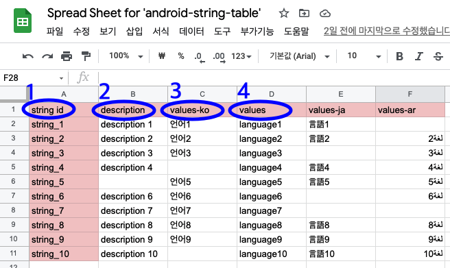

[](https://jitpack.io/#rsupportrnd/android-string-table)
# android-string-table

## 💡 소개
***
구글 스프레드 시트에 작성한 내용을 안드로이드 스튜디오에서 사용 가능한 문자열 리소스 파일(.xml)로 변환한다.

## 💡 Package별 기능 상세
***
### com.rsupport.download
구글 시트를 엑설 파일(.xlsx)로 다운로드 한다.

### com.rsupport.google
구글 api 관련 패키지

### com.ruspport.stringtable
다운로드 한 엑셀 파일을 이용하여 문자열 리소스 파일을 생성한다.

### com.rsupport.plugin
플러그인 관련 패키지

## 💡플러그인 적용 방법
***
### Groovy DSL
### Build.gradle(:project)
````groovy
buildscript {  
      repositories {  
            google()  
            jcenter()  
            maven { url 'https://jitpack.io' }  
        }  
        dependencies {
            classpath 'com.github.rsupportrnd:android-string-table:1.0.5.12'
      }  
    }
````
### Build.gradle(:app)
````groovy
apply plugin: 'android-string-table'
    
androidStringTable {  
    googleDriveCredentialPath "${project.rootDir}/strings/credentials.json"

    targetSheetUrl 'https://docs.google.com/spreadsheets/d/1W6WG_b40FmvyVbstodPgwA6USc0PRANoemCMN66_peM/edit#gid=0' // full url of sheet included tab gid

    outputXlsxFilePath "${project.rootDir}/strings/archive.xlsx"
    rowPositionColumnHeader 1
    defaultLanguageForValues "en" // values 로 지정됨
    doNotConvertNewLine false

    androidResourcePath "src/main/res"
    outputXmlFileName 'strings_generated'
}
````
***
### Kotlin DSL (Version catalog)

### Build.gradle.kts(:project)
````kotlin
buildscript {
  repositories {
    maven("https://jitpack.io")
  }
  dependencies {
    classpath(libs.rsupportrnd.android.string.table)
  }
}
````

### libs.versions.toml
````toml
[versions]
androidStringTable = "1.0.5.12"

[libraries]
rsupportrnd-android-string-table = { group = "com.github.rsupportrnd", name = "android-string-table", version.ref = "androidStringTable" }

[plugins]
android-string-table = { id = "android-string-table" }
````

### Build.gradle.kts(:app)
````kotlin
plugins {
  alias(libs.plugins.android.string.table)
}

androidStringTable {
  googleDriveCredentialPath.value("${project.rootDir}/strings/credentials.json")
  targetSheetUrl.value("https://docs.google.com/spreadsheets/d/1W6WG_b40FmvyVbstodPgwA6USc0PRANoemCMN66_peM/edit#gid=0") // full url of sheet included tab gid
  outputXlsxFilePath.value("${project.rootDir}/strings/archive.xlsx")
  rowPositionColumnHeader?.value(1)
  defaultLanguageForValues.value("en") // values 로 지정됨
  doNotConvertNewLine?.value(false)
  androidResourcePath.value("src/main/res")
  outputXmlFileName?.value("strings_generated")
}
````

### Setting.gradle.kts(:Project Settings)
````kotlin
dependencyResolutionManagement {
  repositoriesMode.set(RepositoriesMode.FAIL_ON_PROJECT_REPOS)
  repositories {
    google()
    mavenCentral()
    maven("https://jitpack.io")
  }
}
````


## 💡 Credential 파일 다운로드 방법
[Guide to get google credential](guide-google-credential.md)
    
## 💡 플러그인 적용시 생성되는 task
***

- **updateResource**
  
  스프레드 시트를 다운로드하고 문자열 리소스 파일(.xml)을 생성한다.
- **downloadSpreadsheet**

  스프레드 시트를 다운로드 한다.
- **generateStringsXmls**

  문자열 리소스 파일(.xml)을 생성한다.

## 💡 플러그인 적용 가능한 스프레드 시트 작성 방법
***
➰예제 스프레드 시트 : https://docs.google.com/spreadsheets/d/1W6WG_b40FmvyVbstodPgwA6USc0PRANoemCMN66_peM/edit#gid=0


1. 인덱스 행을 표시하기 위해 "id" 혹은 "identification"을 포함한 문자열을 입력한다.
2. 인덱스 행의 셀 내부 문자열에 "values"를 포함하지 않은 열은 파싱되지 않고 넘어간다.
3. 안드로이드 스튜디오에서 국가와 언어 별로 string.xml 파일이 담긴 values 폴더를 명명하는 법칙과 동일하게 "values-국가, 언어 코드"로 해당 열의 국가와 언어를 표기한다.
4. 국가와 언어 코드가 표기되지 않은 단순 "values" 열은 기본 문자열 파일로 변환된다.

## 💡 스프레드 시트 URL
***
공유 기능으로 링크 복사를 하는 것이 아니고 주소창에 있는 주소를 직접 복사해서 붙여넣는다.

The MIT License (MIT)
=====================

Copyright © 2024 RSUPPORT

Permission is hereby granted, free of charge, to any person
obtaining a copy of this software and associated documentation
files (the “Software”), to deal in the Software without
restriction, including without limitation the rights to use,
copy, modify, merge, publish, distribute, sublicense, and/or sell
copies of the Software, and to permit persons to whom the
Software is furnished to do so, subject to the following
conditions:

The above copyright notice and this permission notice shall be
included in all copies or substantial portions of the Software.

THE SOFTWARE IS PROVIDED “AS IS”, WITHOUT WARRANTY OF ANY KIND,
EXPRESS OR IMPLIED, INCLUDING BUT NOT LIMITED TO THE WARRANTIES
OF MERCHANTABILITY, FITNESS FOR A PARTICULAR PURPOSE AND
NONINFRINGEMENT. IN NO EVENT SHALL THE AUTHORS OR COPYRIGHT
HOLDERS BE LIABLE FOR ANY CLAIM, DAMAGES OR OTHER LIABILITY,
WHETHER IN AN ACTION OF CONTRACT, TORT OR OTHERWISE, ARISING
FROM, OUT OF OR IN CONNECTION WITH THE SOFTWARE OR THE USE OR
OTHER DEALINGS IN THE SOFTWARE.

