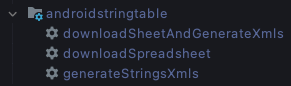
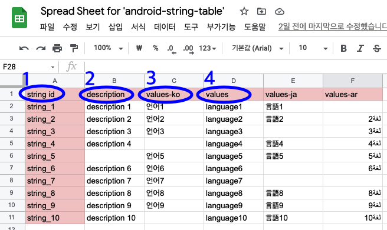

[](https://jitpack.io/#rsupportrnd/android-string-table)
# android-string-table

## 💡 Overview
***
Converts a Google Spreadsheet into Android string resource files (`strings_generated.xml`) that Android Studio can consume directly.

## 💡 Requirements
***
- **JDK 21 or higher** — Android Studio Ladybug (2024.2.1) and newer ship JDK 21 by default. Older IDEs must be upgraded or pointed at a JDK 21 runtime.
- **Gradle 8.10+** (wrapper)
- **Android Gradle Plugin 8.0+**

## 💡 Package structure
***
### `com.rsupport.download`
Downloads a Google Sheet as an Excel file (`.xlsx`).

### `com.rsupport.google`
Google API wrappers (Drive / Sheets / OAuth).

### `com.rsupport.stringtable`
Generates string resource files from the downloaded Excel file.

### `com.rsupport.plugin`
Gradle plugin wiring — exposes the `androidStringTable { ... }` extension and registers the tasks below.

## 💡 Applying the plugin
***
### Kotlin DSL (with Version catalog)

#### `build.gradle.kts` (project)
```kotlin
buildscript {
  repositories {
    maven("https://jitpack.io")
  }
  dependencies {
    classpath(libs.rsupportrnd.android.string.table)
  }
}
```

#### `libs.versions.toml`
```toml
[versions]
androidStringTable = "1.2.0"

[libraries]
rsupportrnd-android-string-table = { group = "com.github.rsupportrnd", name = "android-string-table", version.ref = "androidStringTable" }

[plugins]
android-string-table = { id = "android-string-table" }
```

#### `build.gradle.kts` (app)
```kotlin
plugins {
  alias(libs.plugins.android.string.table)
}

androidStringTable {
  googleDriveCredentialPath.set("${project.rootDir}/strings/credentials.json")
  targetSheetUrl.set("https://docs.google.com/spreadsheets/d/1W6WG_b40FmvyVbstodPgwA6USc0PRANoemCMN66_peM/edit#gid=0") // full sheet URL including the tab gid
  outputXlsxFilePath.set("${project.rootDir}/strings/archive.xlsx")
  androidResourcePath.set("$projectDir/src/main/res")

  // optional below
  rowPositionColumnHeader.set(1)
  defaultLanguageForValues.set("en") // this language's column is written to `values/` instead of `values-en/`
  doNotConvertNewLine.set(false)
  outputXmlFileName.set("strings_generated")
}
```

#### `settings.gradle.kts` (project settings)
```kotlin
dependencyResolutionManagement {
  repositoriesMode.set(RepositoriesMode.FAIL_ON_PROJECT_REPOS)
  repositories {
    google()
    mavenCentral()
    maven("https://jitpack.io")
  }
}
```
***
### Groovy DSL
#### `build.gradle` (project)
```groovy
buildscript {
    repositories {
        google()
        mavenCentral()
        maven { url 'https://jitpack.io' }
    }
    dependencies {
        classpath 'com.github.rsupportrnd:android-string-table:1.2.0'
    }
}
```
#### `build.gradle` (app)
```groovy
apply plugin: 'android-string-table'

androidStringTable {
    googleDriveCredentialPath "${project.rootDir}/strings/credentials.json"

    targetSheetUrl 'https://docs.google.com/spreadsheets/d/1W6WG_b40FmvyVbstodPgwA6USc0PRANoemCMN66_peM/edit#gid=0' // full sheet URL including the tab gid
    outputXlsxFilePath "${project.rootDir}/strings/archive.xlsx"
    androidResourcePath "src/main/res"

    // optional below
    rowPositionColumnHeader 1
    defaultLanguageForValues "en" // this language's column is written to `values/` instead of `values-en/`
    doNotConvertNewLine false
    outputXmlFileName "strings_generated.xml"
}
```

## 💡 Getting the Google credential file
[Guide to obtaining a Google credential](guide-google-credential.md)

## 💡 Tasks registered by the plugin
***

- **updateResource**

  Downloads the spreadsheet and generates string resource files (`.xml`).
- **downloadSpreadsheet**

  Downloads the spreadsheet only.
- **generateStringsXmls**

  Generates string resource files from the already-downloaded spreadsheet.

## 💡 Spreadsheet authoring rules
***
➰ Example spreadsheet: https://docs.google.com/spreadsheets/d/1W6WG_b40FmvyVbstodPgwA6USc0PRANoemCMN66_peM/edit#gid=0


1. To mark the index (header) row, enter a string that contains `id` or `identification` in the first column.
2. In the index row, any column whose header does not contain `values` and is not a valid language code is skipped.
3. Name each locale column with the same qualifier convention Android uses for `values-*` folders (`values-<language-code>`, e.g. `values-ko`, `values-ja`).
4. A plain `values` column (no language suffix) becomes the default strings file. If `defaultLanguageForValues` is set, the matching column is written to `values/` instead of `values-<code>/`.

## 💡 Spreadsheet URL
***
Copy the URL directly from the browser address bar — do **not** use the Share → Copy Link option, which produces a different URL shape the plugin cannot parse.

The MIT License (MIT)
=====================

Copyright © 2026 RSUPPORT

Permission is hereby granted, free of charge, to any person
obtaining a copy of this software and associated documentation
files (the "Software"), to deal in the Software without
restriction, including without limitation the rights to use,
copy, modify, merge, publish, distribute, sublicense, and/or sell
copies of the Software, and to permit persons to whom the
Software is furnished to do so, subject to the following
conditions:

The above copyright notice and this permission notice shall be
included in all copies or substantial portions of the Software.

THE SOFTWARE IS PROVIDED "AS IS", WITHOUT WARRANTY OF ANY KIND,
EXPRESS OR IMPLIED, INCLUDING BUT NOT LIMITED TO THE WARRANTIES
OF MERCHANTABILITY, FITNESS FOR A PARTICULAR PURPOSE AND
NONINFRINGEMENT. IN NO EVENT SHALL THE AUTHORS OR COPYRIGHT
HOLDERS BE LIABLE FOR ANY CLAIM, DAMAGES OR OTHER LIABILITY,
WHETHER IN AN ACTION OF CONTRACT, TORT OR OTHERWISE, ARISING
FROM, OUT OF OR IN CONNECTION WITH THE SOFTWARE OR THE USE OR
OTHER DEALINGS IN THE SOFTWARE.
