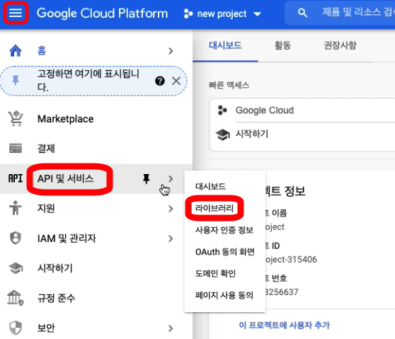
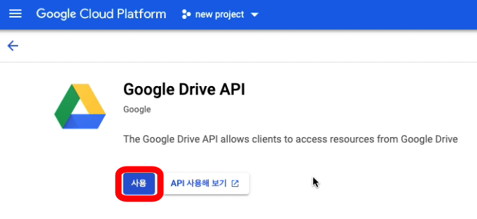
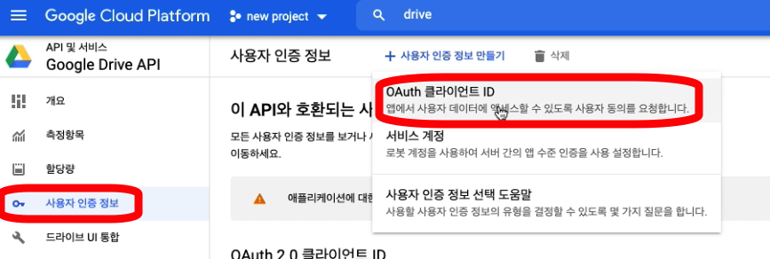

## 💡 Credential 파일 다운로드 방법
***
**1. 구글 클라우드 콘솔(https://console.cloud.google.com/) 접속 후 로그인**

**2. 프로젝트 생성 혹은 프로젝트 선택**

**3. "API 및 서비스" 메뉴에서 "라이브러리" 선택**

**4. Google Sheet API, Google Drive API 검색하여 사용 설정**

**5. "사용자 인증 정보"에서 "사용자 인증 정보 만들기" 클릭 후 "OAuth 클라이언트 ID" 선택**

**6. "동의화면 구성" 버튼 클릭**

**7. 프로젝트의 목적에 맞게 동의화면 구성**

**8. "OAuth 클라이언트 ID" 생성 다시 시작**

**9. 어플리케이션 유형을 "데스크톱 앱"으로 설정. 이름을 설정 후 "만들기" 버튼 클릭**

**10. OAuth 2.0 클라이언트 ID 목록에서 다운로드 버튼을 클릭하면 client_secret_XXX.json 파일이 다운로드 되는데, 이 json 파일이 credential 파일이다.**

