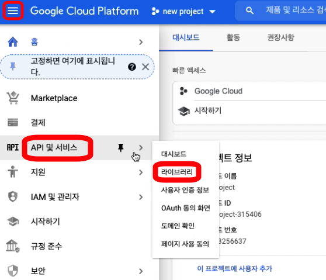
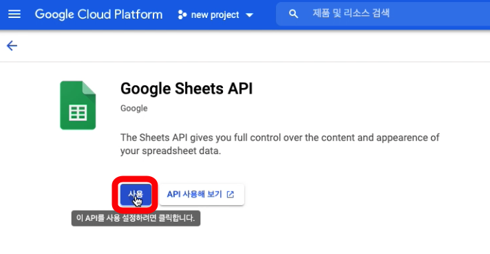
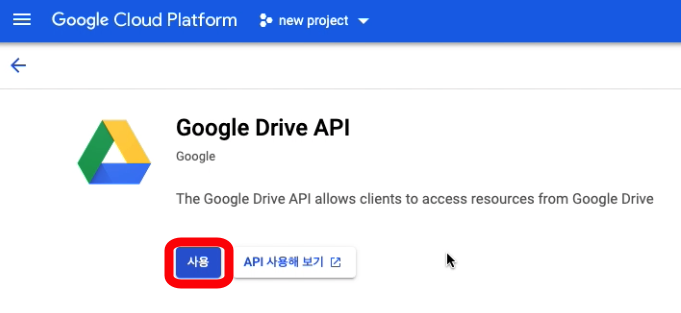
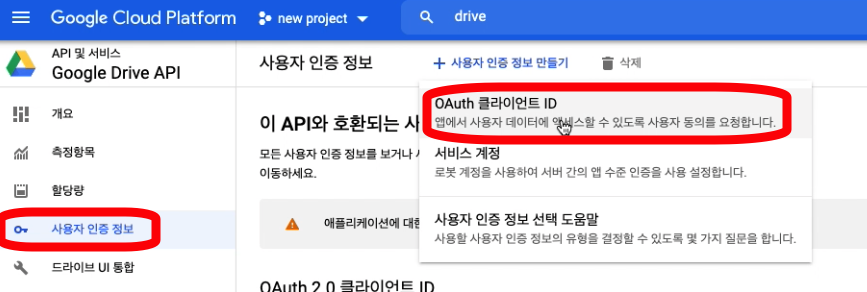
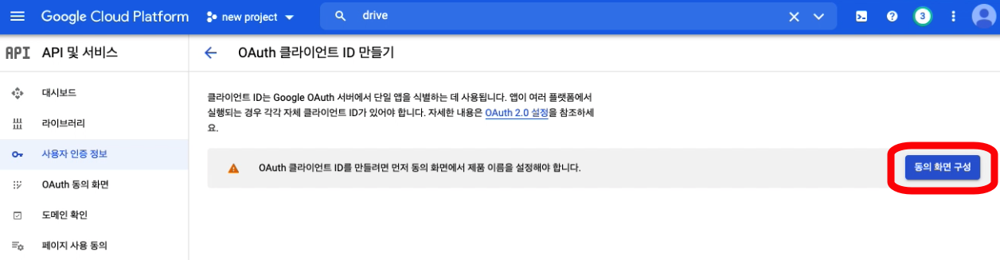
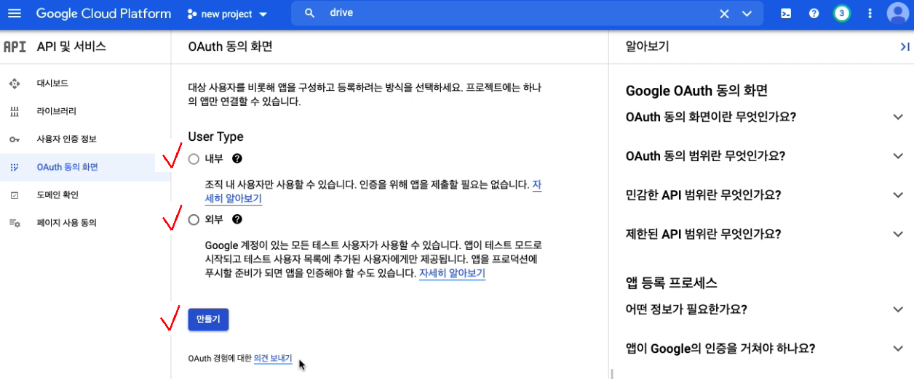
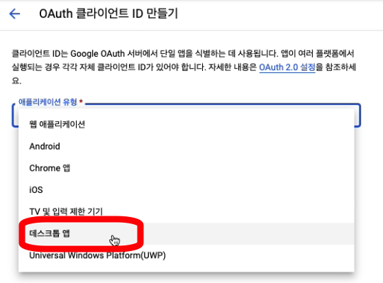
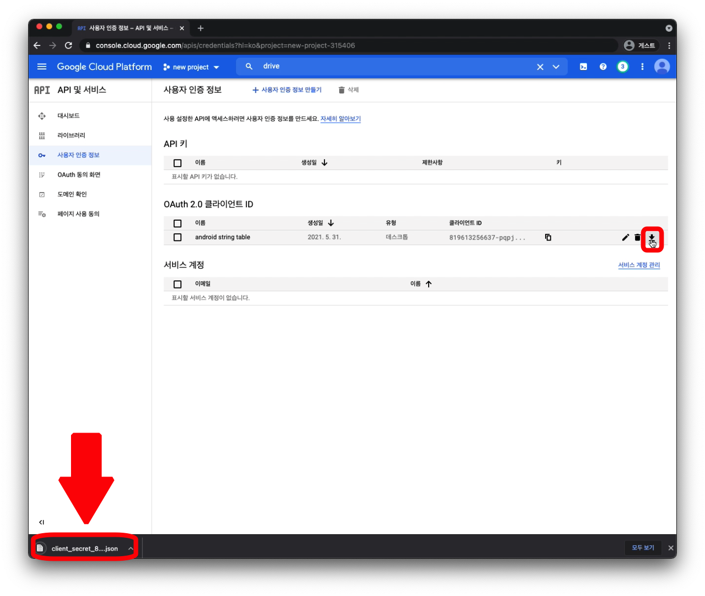

## 💡 How to obtain the Google credential file
***
**1. Open the Google Cloud Console (https://console.cloud.google.com/) and sign in.**

**2. Create a new project or select an existing one.**

**3. In the "APIs & Services" menu, open "Library".**

**4. Search for and enable both the Google Sheets API and the Google Drive API.**

**5. Under "Credentials", click "Create Credentials" and choose "OAuth client ID".**

**6. Click the "Configure consent screen" button.**

**7. Configure the consent screen to match your project.**

**8. Return to creating the OAuth client ID.**

**9. Set Application type to "Desktop app", give it a name, then click "Create".**

**10. From the OAuth 2.0 Client IDs list, click the download button; a `client_secret_XXX.json` file is downloaded. That JSON file is your credential.**

